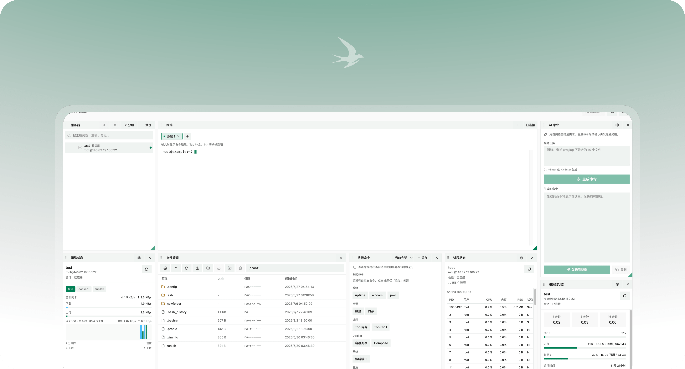

<p align="center">
  <picture>
    <source media="(prefers-color-scheme: dark)" srcset="web/public/logo-dark.png" />
    <source media="(prefers-color-scheme: light)" srcset="web/public/logo-light.png" />
    
  </picture>
</p>

<h1 align="center">ternssh</h1>

<p align="center">
  基于 Cloudflare 的 SSH 工作台<br />
  可拖拽仪表盘 · 终端 · SFTP · 状态监控
</p>

<p align="center">
  <a href="LICENSE">GPL-3.0-or-later</a>
  ·
  <a href="README.md">English</a>
</p>

<p align="center">
  <a href="https://deploy.workers.cloudflare.com/?url=https://github.com/qq76922/ternssh">
    
  </a>
</p>

<p align="center">
  <picture>
    <source media="(prefers-color-scheme: dark)" srcset="docs/preview-dark.png" />
    <source media="(prefers-color-scheme: light)" srcset="docs/preview-light.png" />
    
  </picture>
</p>

---

**ternssh** 是一款运行在 Cloudflare Edge 上的 SSH 管理工具。完整文档见 **[文档](https://ternssh.com/docs/home)**。

## 部署

### Docker 一键启动

使用预构建镜像（推荐）：

```bash
docker run -d \
  --name ternssh \
  -p 8787:8787 \
  -v ternssh-data:/app/.wrangler \
  --restart unless-stopped \
  ghcr.io/haradakashiwa/ternssh:latest
```

或使用 Docker Compose：

```bash
docker compose -f docker-compose.ghcr.yml up -d
```

从源码构建：

```bash
docker compose up -d --build
```

启动后访问 http://localhost:8787。如需启用 Cloudflare Access 认证，可添加环境变量 `ACCESS_TEAM_DOMAIN` 与 `ACCESS_AUD`。

### Cloudflare Workers

详见 [部署指南](https://ternssh.com/docs/deployment)。
